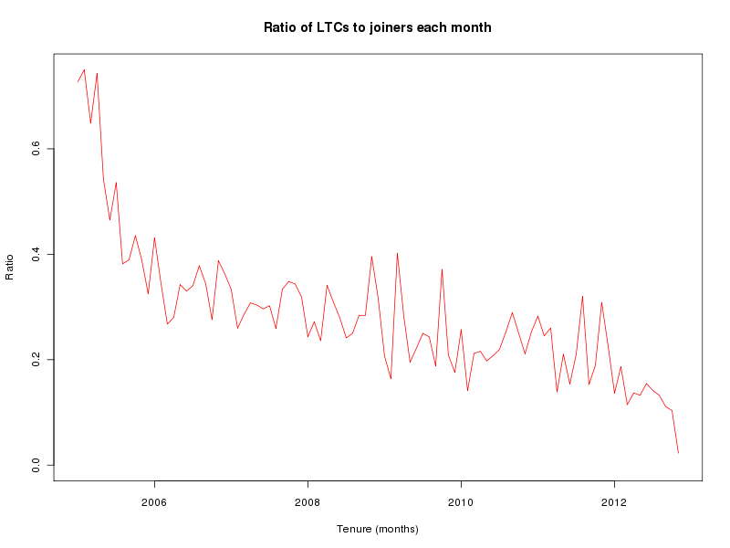

# 关于Linux kernel开发的研究

陈庆英     
2016-1-30

-------------------------------
## 大纲
- ### 社区的整体环境、趋势
- ### 开发者的行为轨迹分析
- ### 社区的开发者组织结构

-------------------------------

</br>

### 1. 社区的整体环境、趋势
>
- ##### Changes, files touched, modules touched 数量随时间的变化
- ##### Authors, committers, new comers, LTC数量随时间的变化
- ##### 在以上各个量度中，各个模块有什么差异

</br>

##### 1.1  Changes, files touched, modules touched 数量随时间的变化


##### 1.2 Authors, committers, new comers, LTC数量随时间的变化



##### 1.3 在以上各个量度中，各个模块有什么差异
- changes数量

- Authors数量

- Committers数量

- Author to committer 比率


##### 1.4 小结
从整体上看，Linux kernel开发社区颇为热闹，越来越多的贡献者参与到社区当中来，同时committer的数量也在保持稳步的增长。但也要注意到，new comer成为长期贡献者的人数却是没有跟上的。在各个模块上，我们看到，drivers和arch，特别是drivers，不管是从changes、authors还是committers的数量上看，表现出了有别于其他模块的增长趋势。

### 2. 开发者的行为轨迹分析
>
- ##### author、committer是否在多个模块上贡献
- ##### author如何在各个模块之间转变
- ##### committer如何在各个模块之间转变
- ##### committer如何成长起来的

</br>

##### 2.1 author、committer是否在多个模块上贡献


##### 2.2 author如何在各个模块之间转变

- author进入社区贡献的第一模块

62.78%的author的第一个贡献模块是drviers， 12.93%是arch。

```
> t1    # author进入社区贡献的第一模块
  dr   mm   fs   ar   ne   ke   li   so   cr   bl   to   se   vi   Do   ip   sc
7667  164  665 1579  917  314   51  549   33   34   81   52   16   18   12   40
  sa   in   fi   us
   1   17    1    2
> prop.table(t1)*100
          dr           mm           fs           ar           ne           ke
62.777368378  1.342831409  5.445017604 12.928846311  7.508392696  2.571030869
          li           so           cr           bl           to           se
 0.417587816  4.495210022  0.270203881  0.278391878  0.663227708  0.425775813
          vi           Do           ip           sc           sa           in
 0.131007942  0.147383935  0.098255957  0.327519856  0.008187996  0.139195939
          fi           us
 0.008187996  0.016375993
```
