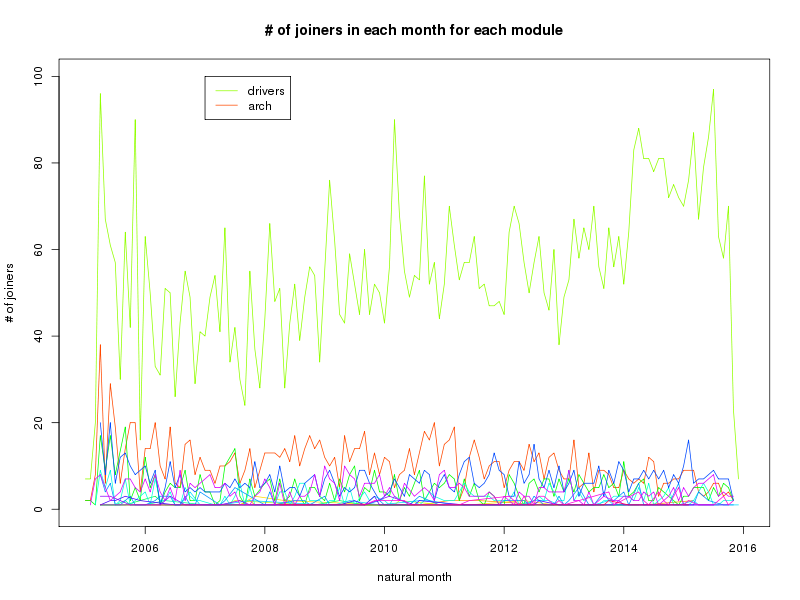
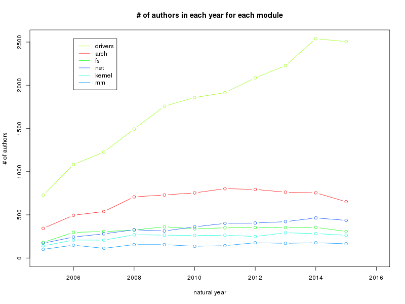
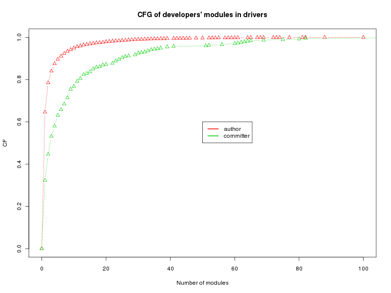
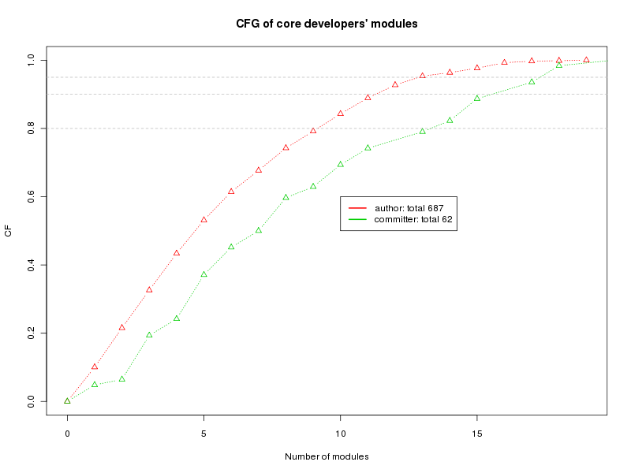
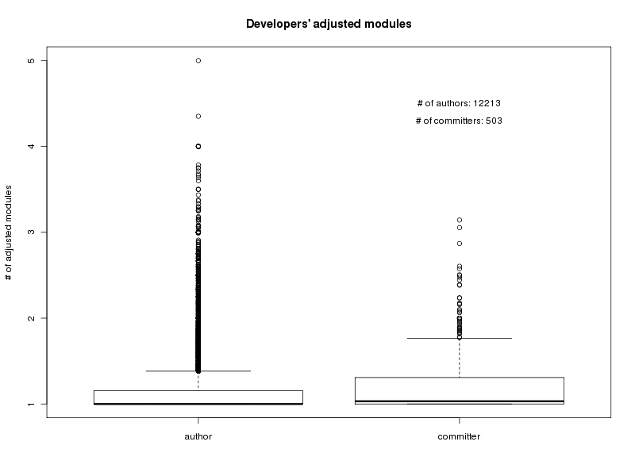
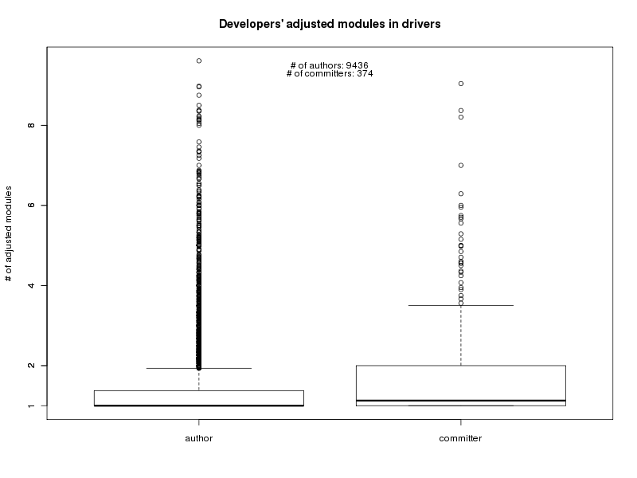
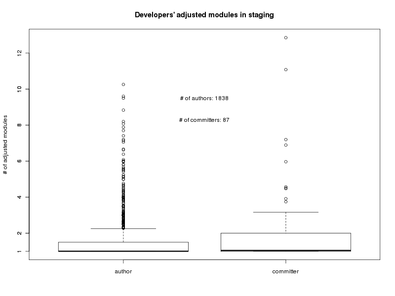

## 探索
了解一些基本情况，发现可能存在的问题。

下面的图片都在[pics](./pics)目录下。
#### 整体情况
- 每个月LOC 

- 每个月changes, mods, files

- 每个月开发者情况

- 每个月LTC的比例

#### 各模块上（root级下的目录）
关于源代码的组织结构，参见[The Linux Kernel: The Source Code](http://www.linux.org/threads/the-linux-kernel-the-source-code.4204/).

- changes数量

- Authors数量

- Committers数量

- Joiners数量（new comers）

- New comitters

由于new committer的数量少，按年份来：

- changes数量

- Authors数量

- Committers数量

- Joiners数量（new comers）

- New comitters

年增长率

- changes数量

- Authors数量

- Committers数量

- Joiners数量（new comers）

#### 在drivers模块往下看一层
关于drivers目录，参见[这篇文章](http://www.linux.org/threads/the-linux-kernel-drivers.4205/)，或直接点[这里](./docs/drivers-mod.md).

- changes数量

选择changes数量总数前5的模块，并，每月changes最大数量前5的模块。要具体的见[这里](data/numChgs.in.month.mdrivers.al.txt)

- authors数量

每月auhtors最大数量前8的模块。要具体的见[这里](data/numAthrs.in.month.mdrivers.al.txt)

- committers数量

每月committers最大数量前5的模块。要具体的见[这里](./data/numCmtrs.in.month.mdrivers.al.txt)

## 一个开发者（author/committer）会在几个模块做贡献呢？
- 在root级别，即整个项目

- 在drivers级别

- 在drivers/staging级别

- 在root级别，去changes数量排序后累计占比80%的author

>考虑到开发者在各个模块之间的贡献可能差很多，所以调整后再看看。至于调整方法，几个例子，一个开发者向A,B两个模块提交代码，changes分别是100次、10次，则调整的模块数是(100 + 10) / max(100, 10) = 1 + 10 / 100 = 1.1个

- 在root级别，即整个项目

- 在drivers级别

- 在drivers/staging级别

## 一个author的代码由多少个committer提交，一个committer提交多少人的代码

