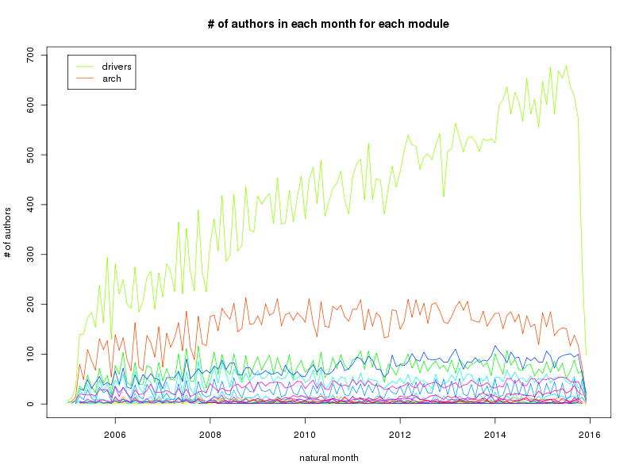
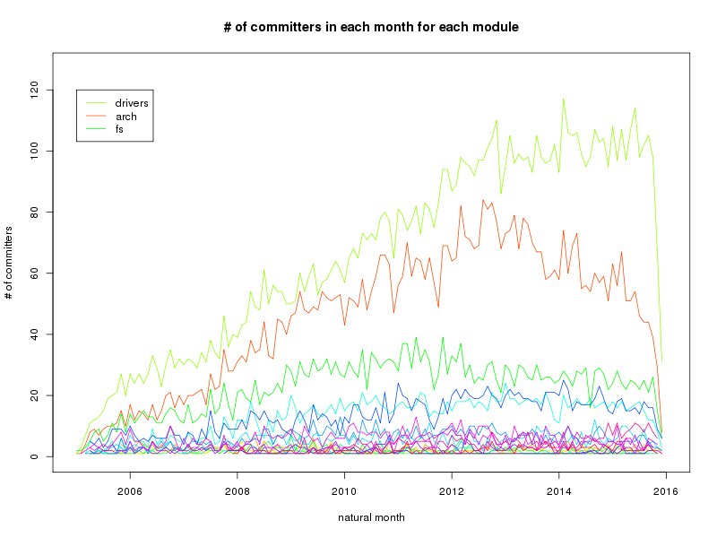

## 探索
了解一些基本情况，发现可能存在的问题。

下面的图片都在[pics](./pics)目录下。
#### 整体情况
- 每个月LOC 

- 每个月changes, mods, files

- 每个月开发者情况

- 每个月LTC的比例

#### 各模块上（root级下的目录）
关于源代码的组织结构，参见[The Linux Kernel: The Source Code](http://www.linux.org/threads/the-linux-kernel-the-source-code.4204/).

- changes数量

- Authors数量

- Committers数量

- Joiners数量（new comers）

#### 在drivers模块往下看一层
关于drivers目录，参见[这篇文章](http://www.linux.org/threads/the-linux-kernel-drivers.4205/)，或直接点[这里](./docs/drivers-mod.md).

- changes数量

选择changes数量总数前5的模块，并，每月changes最大数量前5的模块。要具体的见[这里](data/numChgs.in.month.mdrivers.al.txt)

- authors数量

每月auhtors最大数量前8的模块。要具体的见[这里](numAthrs.in.month.mdrivers.al.txt)

- committers数量

每月committers最大数量前5的模块。要具体的见[这里](numCmtrs.in.month.mdrivers.al.txt)

