# 这个文件没有细心整理，有不少错误，慎看！
<br/>
<br/>
<br/>
<br/>
# 为什么drivers的author to committer的比率要比其他模块都高很多
drivers的author to committer的比率要比其他模块都高很多。从趋势来看，大部分模块的作者/提交者比率在减小。
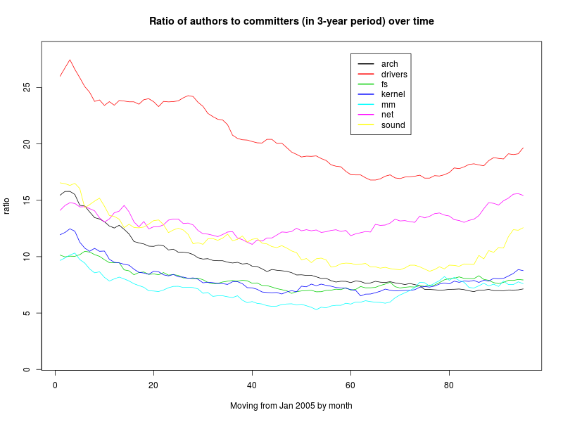


> ### 是不是drivers的author多，但是delta少，即driver模块的committer任务不是太多？

这一点并不是。
See below 
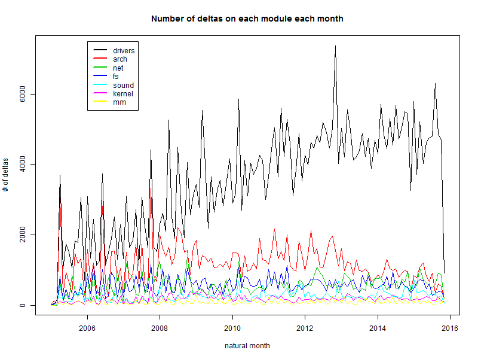

> ### 在drivers中，再往下看一层

关于drivers的介绍，请看[drivers的介绍](./docs/drivers-mod.md)
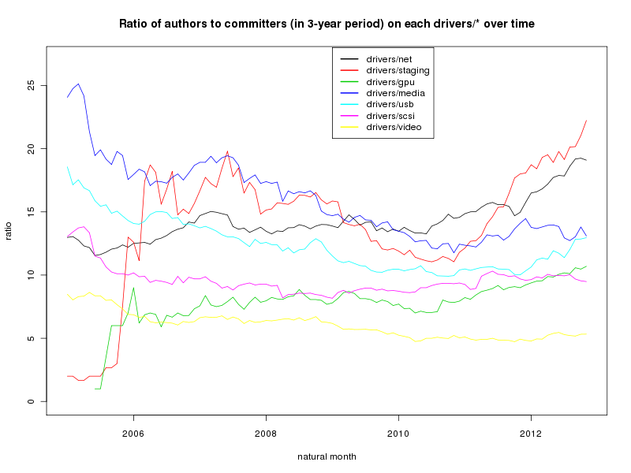

> ### 从作者、提交者的邮箱域名看其所属公司、组织

基于邮箱域名的推断能否反映实际情况？从delta记录来看，***gmail.com***是使用最多的邮箱域名，占比为9.8%.


> ### How to contribute new device driver to Linux kernel?

* Documentation/development-process/*
* Documentation/SubmittingDrivers
* Documentation/SubmittingPatches
* Documentation/SubmitChecklist

# Merge Aliases
一个开发者可能有多个name、email，使用简单的并查集算法得到每个开发者使用多少个alias。下表的第一行表示alias数量，第二行表示使用这么多数量alias的开发者数量，第三行表示占比。
```
      [,1]    [,2]    [,3]   [,4]   [,5]  [,6] [,7]  [,8]  [,9] [,10] [,11]
[1,]  1.00    2.00    3.00   4.00   5.00  6.00  7.0  8.00  9.00 10.00 11.00
[2,] 91.00 9220.00 1804.00 639.00 256.00 93.00 49.0 29.00 18.00  9.00  5.00
[3,]  0.74   75.41   14.75   5.23   2.09  0.76  0.4  0.24  0.15  0.07  0.04
     [,12] [,13] [,14] [,15] [,16] [,17]
[1,] 12.00 13.00 14.00 15.00 17.00 29.00
[2,]  4.00  1.00  4.00  1.00  3.00  1.00
[3,]  0.03  0.01  0.03  0.01  0.02  0.01
```

### 2016-1-15， openthos
1. 加入时间事件
2. 难
- 旧人在，新人很难入
- 本身对技术能力要求高，难

### 对drivers模块的贡献、提交机制，人员结构进行分析
### 网络上的资源，再多一些具体的分析

# Core Author/Committer Definition
如果按照贡献delta数量来定义，即把delta数量从大到小排序，取累计80%delta对应的作者为core Author/Committer，可能会有这样的问题：一个模块（如drivers）集中了大量的delta，那么这种定义方式就会把其他模块的Author/Committer过滤掉。

还是先搞清楚structure

# Structure
要分析structure，可以分析

- 每个author/committer为几个模块做贡献，如何分布
- author/committer如何对应起来，每个author的代码由几个committer提交，每个committer提交几个人的代码，这些量是如何分布的

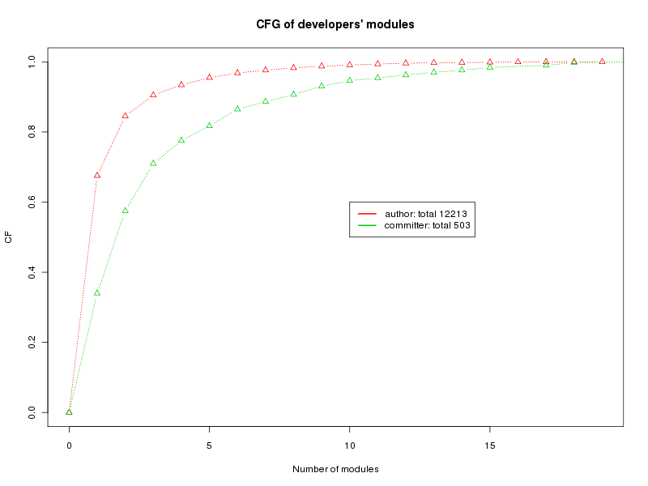
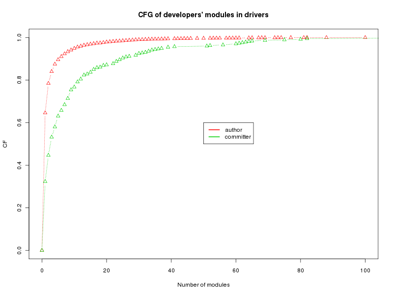
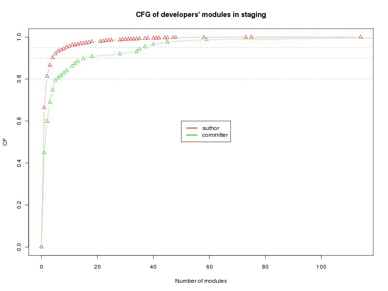
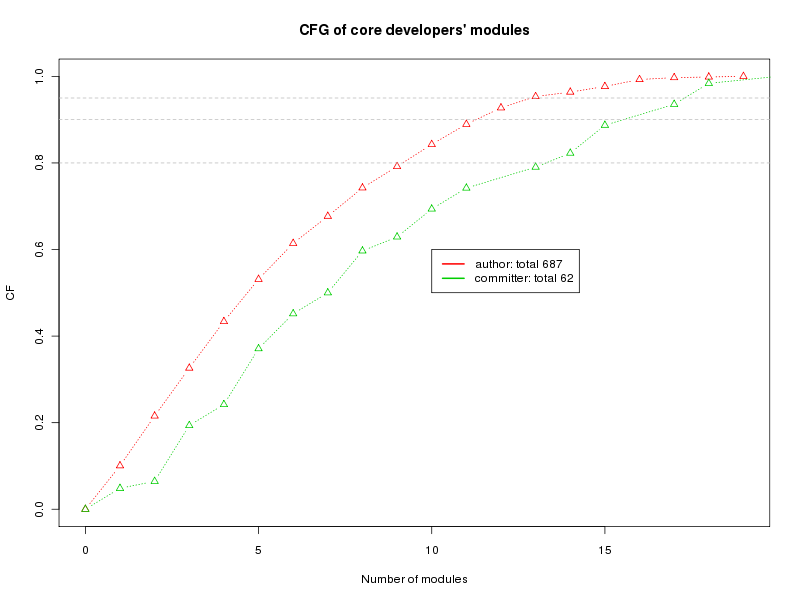

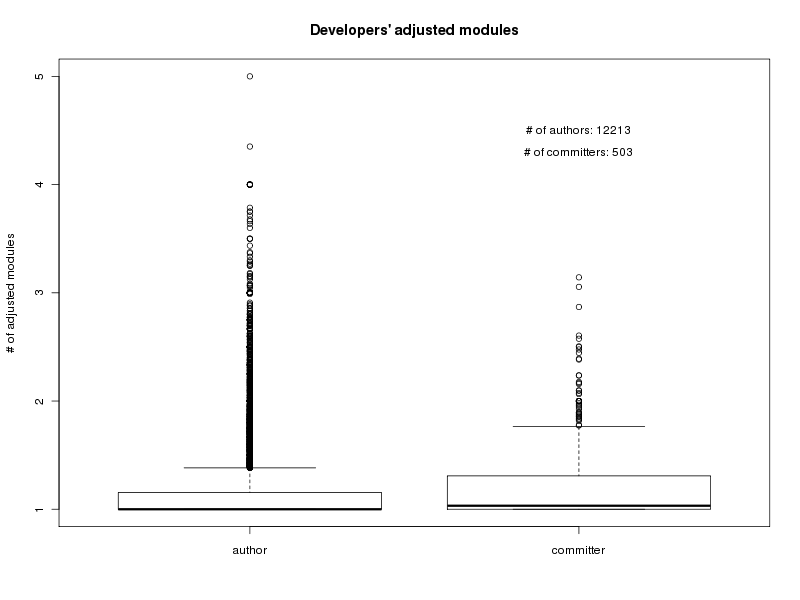
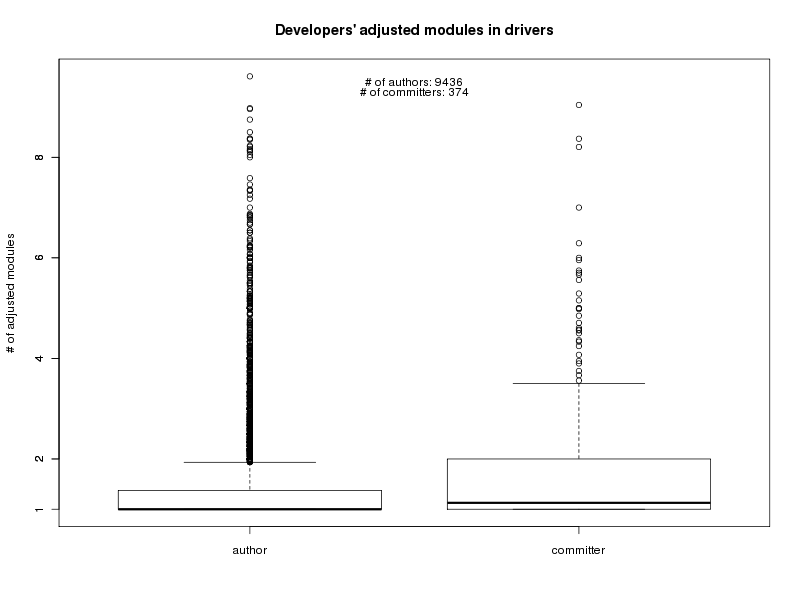
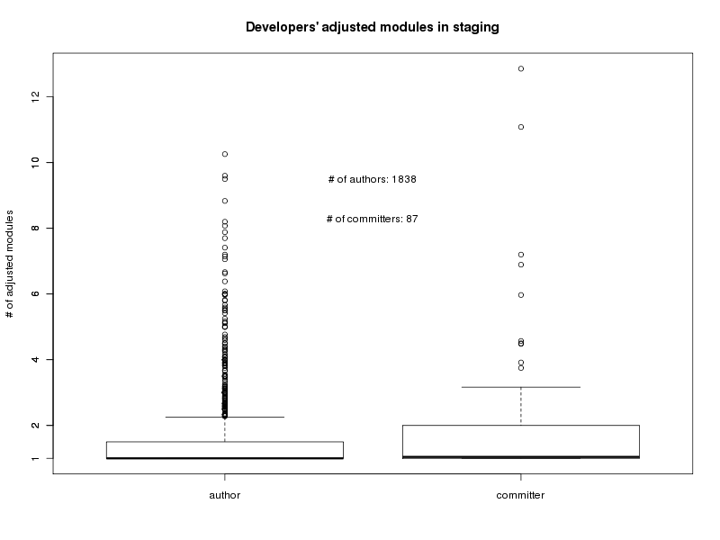


### 我们注意到两个问题
- 只要开发者和某个模块有一次接触，就为这个开发者的模块数加一，这是不合理的。一种修正方法是：对一个开发者而言，确定其贡献最多的模块（根据delta数量,maxdelta），为该开发者模块数加一，对于其他的模块，加上delta数量/maxdelta。
- 把所有的author或者committer混为一谈，是不合适的。由于贡献多的开发者数量少，其涉及的模块较多，故而当把所有的author放一起画boxplot时，boxplot显示的“正常”数据点是贡献少的开发者，而贡献多得开发者成了outlier。

### Log 2016-1-18
- 先不急adjust
- 关于“把所有的author或者committer混为一谈”得到的boxploy：不要忘了目标，不是要得到更好看的图：）
- （drivers下，）哪些是author不是committer但又想成为committer的人？（要认识到有大量的写了代码但是没有被接受的人。）先不要adjust
- 从author变为committer的比率，时间：总的，各模块上. touch第二个模块的时间.(big topic:参与轨迹)
- LOC until given time / tenure till given time
- New comer, new committer：趋势，实事（如安卓）
- staging的变化：本身的变化，其子目录的变化，是否从staging移出来得到支持了
- touch的模块要考虑时间的长短，看一下是否变化
- 是否有做了很久author但是仍然不是committer（查阅一下成为committer的审核机制）
- 为什么会有提交数量极少的committer
- 时间跨度还是以月为宜

##### 参与体系
- 人员结构
- 参与轨迹：

##### 始终一点： 有什么难，为什么难

### 搞清楚贡献体系
- 组织结构，人员结构
    + 搞清楚各类角色：maintainer, committer(same as maintainer?), reviewer, author, etc. 
    + 各类角色的变化：关于maintainer, 看MAINTAINER文件的各个版本；committer和author，看git log的格式化信息，这部分我们已经取出；reviewer，看每个提交的comment信息；Linux Kernel的诸如[Documentation/SubmittingPatches](https://www.kernel.org/doc/Documentation/SubmittingPatches)这些开发者文档中对patch的格式做了要求、说明，在comment信息中，包括的信息有：Signed-off-by, Acked-by, Cc, Reported-by:, Tested-by:, Reviewed-by:, Suggested-by: and Fixes。
    + 根据这些分析，特别是drivers，分析难处
    + 特别注意new comer

### 轨迹
- 从author变为committer的比率，时间：总的，各模块上. touch第二个模块的时间.(big topic:参与轨迹)

    + 总的

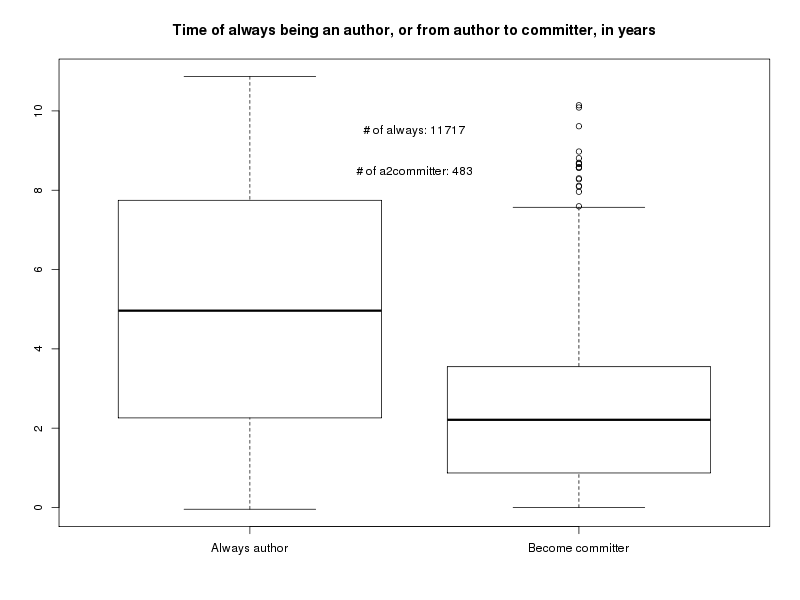
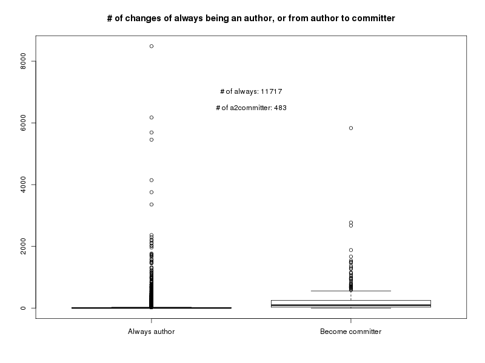

```
> quantile(trc$numChgsBef[trc$tp=='Always author'], c(0.7, 0.8, 0.9, 0.95, 0.97, 0.98, 0.99, 1)) # num: 11717
    70%     80%     90%     95%     97%     98%     99%    100%
   9.00   19.00   55.00  121.20  211.52  297.00  481.20 8485.00
> quantile(trc$numChgsBef[trc$tp=='Become committer'], c(0.7, 0.8, 0.9, 0.95, 0.97, 0.98, 0.99, 1)) # num: 483
    70%     80%     90%     95%     97%     98%     99%    100%
 214.00  301.00  509.00  794.25 1136.45 1324.20 1547.40 5832.00
```

- 以个人为分析对象
    + 

- 可以尝试一下codeface

相关论文： From Developer Networks to Verified Communities: A Fine-Grained Approach


## trace 分析
关于author、committer的贡献模块转变，查看这里：[author](./res/athrTrcTreeSmry.md), [committer](./res/cmtrTrcTreeSmry.md)

在这个转变分析中，还没有区分那些“一次贡献者”、只在一个模块贡献的“持久贡献者”。

### 简化方法
- 一个revision可能有多个mod（实际上这样的revision是少数），可以先把增减行数最多的mod确定为main mod
- 加入时间因素：考虑一段时间内开始贡献的dvpr

也就是：以月份为时间单位，把每个author在一个月内的changes取出来，按照在每个模块的增删行数对模块排序，确定累计增删行数占比80%的模块，作为这个作者在这个月的主贡献模块。这样，我们就能得到每个作者的月份贡献轨迹。然后，对于每个作者，再对轨迹进行简化，方法是，去掉与其前一个月份相同的贡献模块，例如，'a b b c c b'被简化为'a b c b'。

## Narrow 1
- 别想着对‘难’下个定义，量化它，这是弊大于利的：把问题复杂化，却可得太少
- 也许，我们只需列出几个事实，最好是不易发现的，让大家感受到‘嗯，这确实是不太利于开发呀’。那么这些事实可以是哪些呢？首先，我们要从整体环境来看Linux kernel的开发趋势，这会受到多重因素的影响，比如技术因素（Android、新型文件系统、流行新硬件的驱动等）、经济因素等，因为Linux kenel在实际中地位非凡、用户颇多，很受关注。这些因素的影响，在开发数据中可能会有体现，因此我们用一些量度去看这些影响。具体的度量可能包括： # of chgs，# of athrs, # of cmtrs等，看这些量度是如何变化的。
    + LTC 比例下降
    + 稳定成熟的（子）模块，是否很难贡献（直觉如此）
    + 新兴（子）模块
    + 开发者集中地drivers，是否被公司‘控制’？

# product structure
## how the organization of contribution team and culture are affected by product structure in Linux kernel?
- what is product stucture?
    + 从目录层次来看。（arch和drivers，从文件层次来看，都是loose的，arch的ratio为何低，和mm差不多。）
    + 从各个目录的形成来看，drivers是各个硬件驱动代码的合集，mm则不然。（这个由文字叙述，需要相关资料的支持）
    + 从函数调用关系来看。

- what is organization of contribution team and culture?
用3年时间窗口不合理，我猜想老师原来用3年是用来平滑的，但是当把他解释为团队规模时，就不合理了。对于drivers来说，以月为时间单元，得到的ratio值为6左右，以三年为时间单元，就是20+。


3. introduction中到模块的过渡不好。
4. 关于linux kernel的commit机制，如何成为committer需要进一步了解和阐述。这是因为，ratio的含义还应该结合具体的环境。
5. volunteers. commercial participation
6. 
> it is of interest to understand if
the contribution practice of different modules of Linux kernel differs from each other, and how they evolve over time
adapting to different business environments

# product structure
- 从目录层次来看。（arch和drivers，从文件层次来看，都是loose的，arch的ratio为何低，和mm差不多。）
- 从各个目录的形成来看，drivers是各个硬件驱动代码的合集，mm则不然。（这个由文字叙述，需要相关资料的支持）
- 从函数调用关系来看。
- 

# team organization
怎样描述team organization呢？
而且，当我们讨论不同模块

- 用a2c ratio可能不合理。例如，2010~2010.5年的mm，author和committer的对应情况如下：
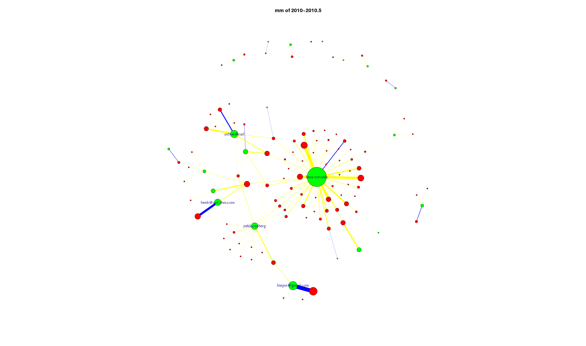

要用a2c，首先要理解'commit'到底是意味着什么。

> 
From: lf_pub_whowriteslinux2015.pdf
<br/>
Who is Reviewing the Work
Patches do not normally pass directly into the mainline kernel; instead, they pass through one of over 100 subsystem trees. Each subsystem tree is dedicated to a specific part of the kernel (examples might be SCSI drivers, x86 architecture code, or networking) and is under the control of a specific maintainer. 
<br/>
When a subsystem maintainer accepts a patch into a subsystem tree, he or she will attach a “Signed-off-by” line to it. This line is a statement that the patch can be legally incorporated into the kernel; the sequence of signoff lines can be used to establish the path by which each change got into the kernel.
<br/>
An interesting (if approximate) view of kernel development can be had by looking at signoff lines, and, in particular, at signoff lines added by developers who are not the original authors of the patches in question. These additional signoffs are usually an indication of review by a subsystem maintainer. Analysis of signoff lines gives a picture of who admits code into the kernel–who the gatekeepers are.

```
[pkuas@bear linux]$ git log --no-merges -n 10000 | grep 'Signed-off-by' | wc -l
20244
[pkuas@bear linux]$ git log --no-merges -n 100000 | grep 'Signed-off-by' | wc -l
197072
[pkuas@bear linux]$ git log --no-merges -n 10000 | grep 'Signed-off-by' | wc -l
20244
[pkuas@bear linux]$ git log --no-merges -n 20000 | grep 'Signed-off-by' | wc -l
39907
[pkuas@bear linux]$ git log --no-merges -n 30000 | grep 'Signed-off-by' | wc -l
59516
[pkuas@bear linux]$ git log --no-merges -n 40000 | grep 'Signed-off-by' | wc -l
78647
[pkuas@bear linux]$ git log --no-merges -n 50000 | grep 'Signed-off-by' | wc -l
98679
[pkuas@bear linux]$ git log --no-merges -n 60000 | grep 'Signed-off-by' | wc -l
118674
```

- 总结以上，从author和committer的对应关系来看。可以定义几种量度：
    + \#cmtr, #athr, #ratio
    + \#core cmtr,#core athr, #core ratio(定义这个量度，原因在与下面，就是发现了在cmtr中二八情况很明显。)
    + \# entropy cmtr, # entropy athr, # entropy ratio（可以处理这样的问题：79%，80%，，，，这个问题core ratio不合理）
- 从一个author的（一段时间内的）co-change的文件网络来看。


关于如何理解团队组织，我们目前有一些感觉了：首先，我们的确可以根据athr和cmtr的数量比率来衡量某些东西，但也有要注意的地方。单纯地使用ratio，可以揭示些东西，但也掩盖了一些东西，原因是ratio对二八原则没有很好的处理。为此，我们可以引入entropy ratio，来揭示核心团队的情况。
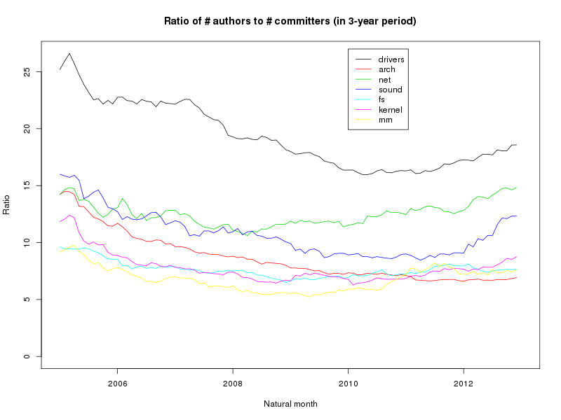
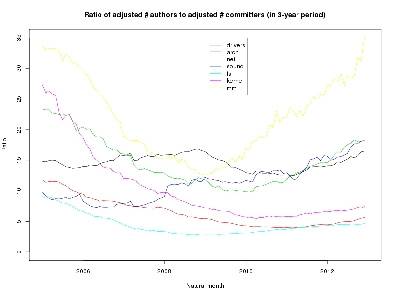

?
- ratio的收敛情况分析
drivers、net、sound一类似乎收敛
kernel、arch、fs一类收敛
- 起始状态为何如此诡异
起始时，团队不稳定，流入流出不稳定

- 为何drivers和arch的ratio差这么多，即便目录机构挺相似的

关于模块结构对团队的影响，我们目前有一些感觉了：单纯地根据ratio

## 规模和流动性
## 以版本发布时间为分隔，分析模块结构变化对团队结构的影响
## 模块结构的变化，团队结构的变化，时间偏移
## code ownership

# Narrow 2
>how does module structure affect contribution organization?

- 假设：以下两个因素对ratio值有影响。
    + module structures
    + contributor features

- 展示我们观察的结果：不同module呈现了不同的ratio
- 根据假设解释我们观察的结果。

## module structure
不同的模块有不同的特征，由于这些不同的特征可能会对ratio值得差异产生了影响。而这些模块具有不同特征的论据包括：
- directory structure，用耦合度来表示,就是下面一个。
- 耦合度。（本来应该用调用关系来衡量耦合度，问一下：能否用code ownership来衡量呢？#owner each file衡量的是团队相关的东西，数值大意味着该文件由多人协作开发，在一个module中，整体的数值大，推出该模块的耦合度高。这样合不合理呢？)(PS: 和Z的计算结果差好多？)可以用ownership来验证耦合度的不同。
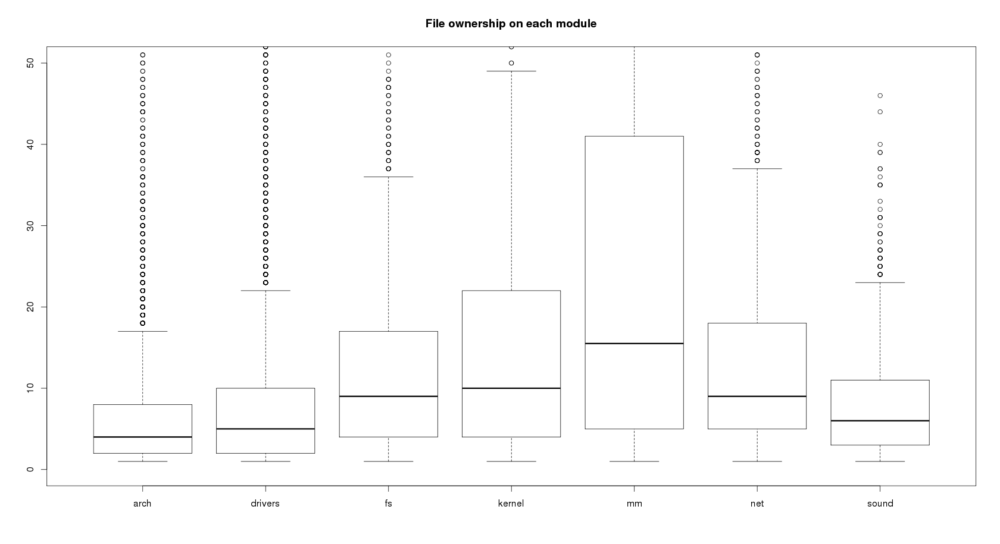 

想了个方法：见code/entropy-modulize.R
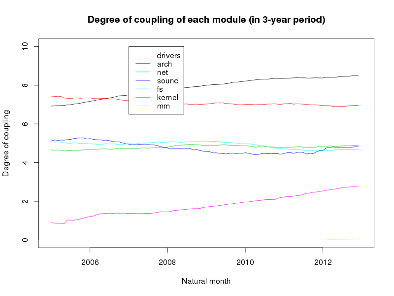

## 

## contributor features
不同的
- contributor type
猜想：drivers的dvpr多来自公司。在drivers中，很多athr的chgs数量很少，即#athr的水分太多，

- objective of contribution


