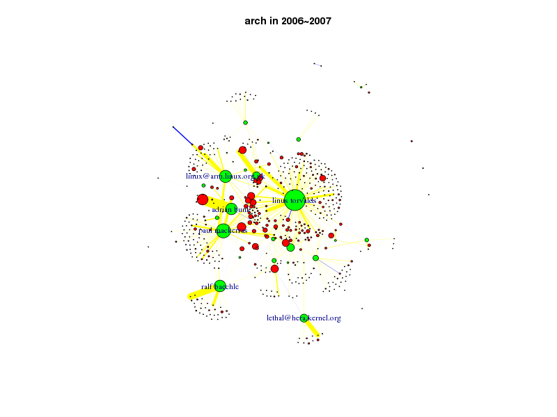
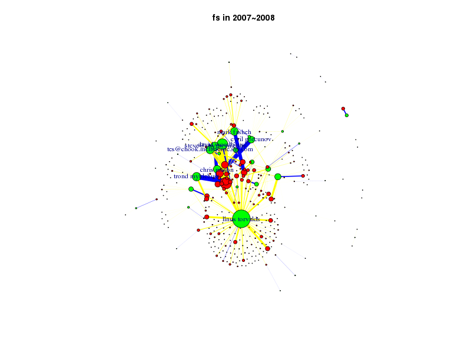
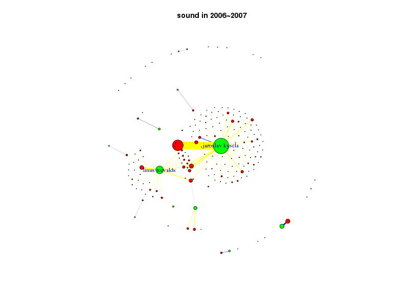
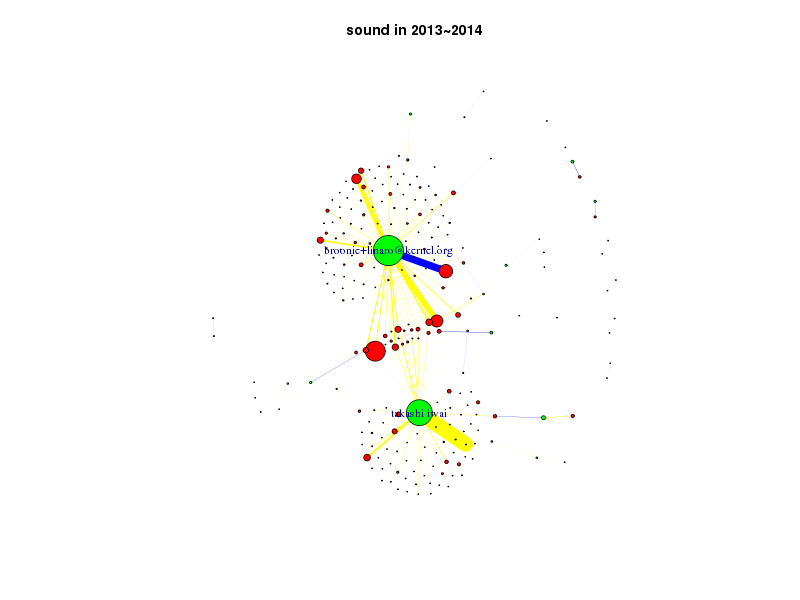

#### 对一个模块，每年一张图。绿色的点表示committer，红色的点表示author，点的面积表示该贡献者在这个时间段内写的/提交的change的数量。边连接一个author和一个committer，边的宽度表示这个author有多少change是由这个committer提交的，边的颜色有两种，蓝色的表示autho和committer是同一个人，黄色的表示autho和committer不是同一个人。
#### 文件名格式： {module}-{year}-net.png
#### 图画的不好，drivers没画，当点数很多时，乱作一团了。

