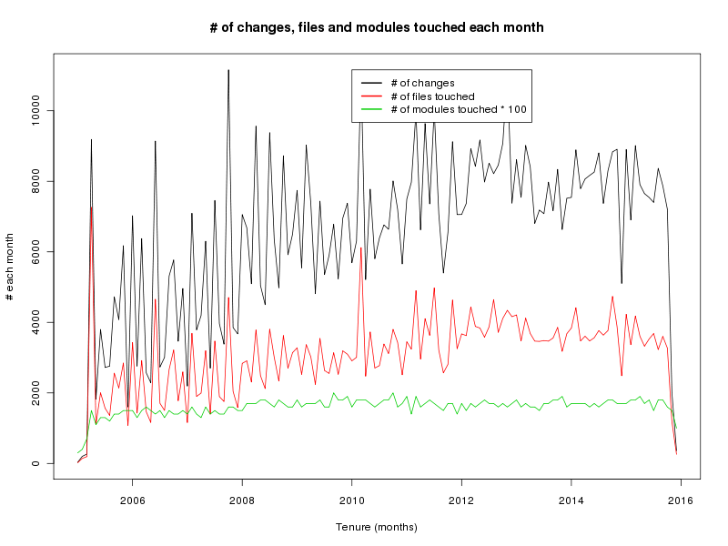
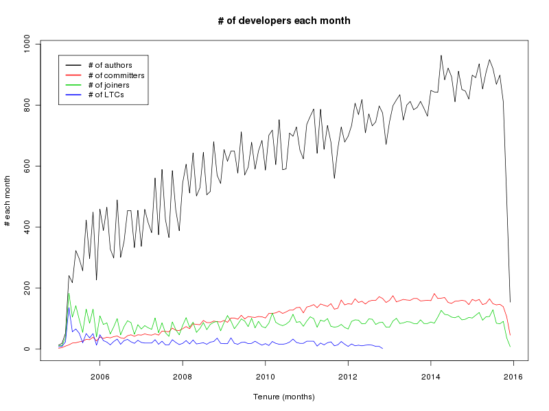

<br/>
<br/>
<br/>
<br/>
<br/>
<br/>
<br/>
# 关于Linux kernel开发的研究
<br/>
<br/>
<br/>
<br/>
陈庆英     
2016-1-30
<br/>
<br/>
<br/>
<br/>
<br/>
<br/>
<br/>
<br/>
-------------------------------
## 大纲
- ### 开发社区的整体环境、趋势
- ### 开发者行为的变化
- ### 开发者的贡献途径(轨迹)
-------------------------------

</br>

### 1. 开发社区的整体环境、趋势
>
- ##### 大的环境，诸如技术因素的变化，用户市场的变化，Android的发展
- ##### 大环境的变化，可以用一些量度在某个侧面上刻画出来：Changes, files touched, modules touched 数量随时间的变化
- ##### Authors, committers, new comers, LTC数量随时间的变化

</br>

##### 1.1  Changes, files touched, modules touched 数量随时间的变化


##### 1.2 Authors, committers, new comers, LTC数量随时间的变化



##### 1.4 小结
从整体上看，Linux kernel开发社区挺热闹的，越来越多的author参与到社区当中来，同时committer的数量也在保持稳步的增长。但也要注意到，new comer成为长期贡献者的人数却是没有跟上的。

### 2. 开发者行为的变化
##### 2.1 在各个模块中，看changes、authors、committers这些量度

- changes数量

- Authors数量

- Committers数量


在各个模块上，我们看到，drivers和arch，特别是drivers，不管是从changes、authors还是committers的数量上看，表现出了有别于其他模块的增长趋势。

##### 2.2 在各个模块中，看核心团队的规模、author  to committer比率
- Core-committers


- Author to committer 比率


除了net, 基本都在减小, 为什么? 协作成本越来越高么?


### 3. 开发者的贡献途径（行为轨迹分析）
>
- ##### author、committer是否在多个模块上贡献
- ##### author轨迹
- ##### committer如何成长起来的

</br>

##### 3.1 author、committer是否在多个模块上贡献


##### 3.2 author轨迹

- author进入社区贡献的第一模块

62.78%的author的第一个贡献模块是drviers， 12.93%是arch，这两个加起来超过了70%。

- 第一个贡献模块为arch的开发者，其中有40%会以drivers为第二贡献模块
</br>

- 第一个贡献模块为drivers的开发者，其中有9.5%会以arch为第二贡献模块（当然大部分是只在drivers上贡献的）

- 第一模块为drivers、arch的author，到其第二模块为mm、kernel等核心模块的时间，中值约为0.4~0.5年
- 第一模块为ke、mm的author，到其第二模块为drivers、arch等模块的时间则相对较短，中值分别为: 'ke-ar', 0.09y; 'ke-dr', 0.18y; 'mm-ar', 0.13y; 'mm-dr', 0.38y。

##### 3.3 committer如何成长起来的
- 成为某module committer的有约40%是从drivers开始贡献, 约60%从 
drivers+arch开始贡献 (包括drivers, arch, kernel, fs, mm).
几乎没人从mm和kernel开始贡献.

- 对于所有committer来说, 从某个moudule开始贡献的不见得会(首先)成为该 
module的committer, 从kernel/mm开始的没人(首先)能成为kernel/mm的committer.
但drivers/arch author 直接到drivers+arch committer的比较多(约75%)

### 4. 对drivers和net下层目录，进行更细粒度的探索
- drivers下的子模块数在不断地增加
```
2005 2006 2007 2008 2009 2010 2011 2012 2013 2014 2015
   52   66   75   82   84   87   95  107  108  112  113
```

- drivers子模块的authors数量


- drivers子模块的committers数量


drivers下面, net和staging是两个最活跃的submodule。

- 在net下，wireless在2011年发展迅速。可能是2008年开始android 
的发展所推动的。

