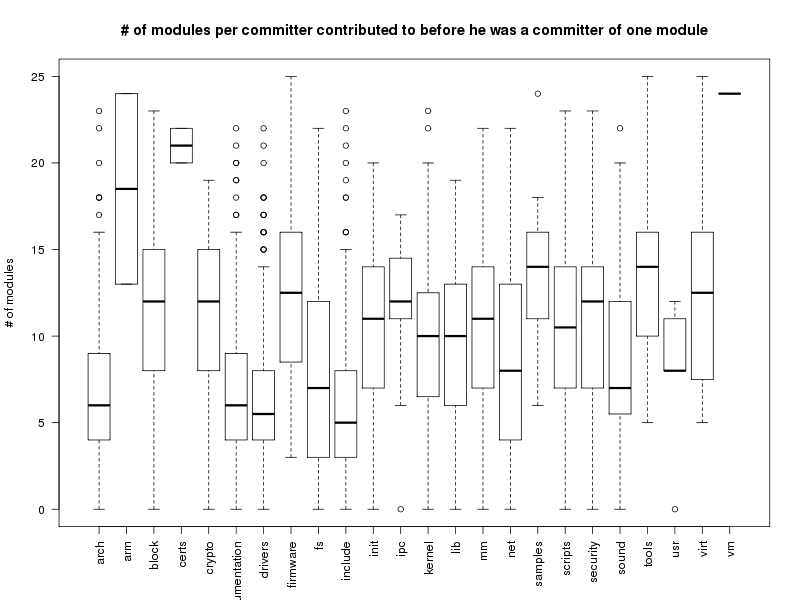
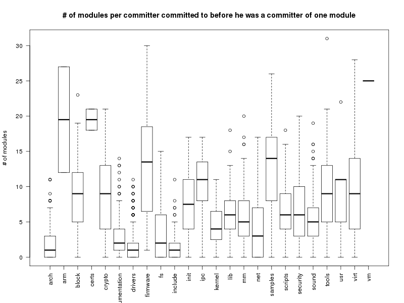

#### 在每个模块中，committer成为这个模块的committer之前在多少个模块做过author

全部的delta，不限定时间、拓展名。



除去那些committer少的模块外，看median, 几个明显较低的模块是arch, Documentation, drivers, fs, include, net, sound.
```
> lapply(numModsBefCmtr.cmtr.mod, mySummary)
$arch
   Min. 1st Qu.  Median    Mean 3rd Qu.    Max.     Num
  0.000   4.000   6.000   6.578   9.000  23.000 329.000

$arm
   Min. 1st Qu.  Median    Mean 3rd Qu.    Max.     Num
  13.00   15.75   18.50   18.50   21.25   24.00    2.00

$block
   Min. 1st Qu.  Median    Mean 3rd Qu.    Max.     Num
   0.00    8.00   12.00   11.62   15.00   23.00   42.00

$certs
   Min. 1st Qu.  Median    Mean 3rd Qu.    Max.     Num
   20.0    20.5    21.0    21.0    21.5    22.0     2.0

$crypto
   Min. 1st Qu.  Median    Mean 3rd Qu.    Max.     Num
   0.00    8.00   12.00   11.36   15.00   19.00   33.00

$Documentation
   Min. 1st Qu.  Median    Mean 3rd Qu.    Max.     Num
  0.000   4.000   6.000   6.979   9.000  22.000 329.000

$drivers
   Min. 1st Qu.  Median    Mean 3rd Qu.    Max.     Num
  0.000   4.000   5.500   6.271   8.000  22.000 380.000

$firmware
   Min. 1st Qu.  Median    Mean 3rd Qu.    Max.     Num
   3.00    9.25   12.50   12.69   16.00   25.00   16.00

$fs
   Min. 1st Qu.  Median    Mean 3rd Qu.    Max.     Num
  0.000   3.000   7.000   7.554  11.750  22.000 166.000

$include
   Min. 1st Qu.  Median    Mean 3rd Qu.    Max.     Num
  0.000   3.000   5.000   6.094   8.000  23.000 384.000

$init
   Min. 1st Qu.  Median    Mean 3rd Qu.    Max.     Num
   0.00    7.25   11.00   10.96   14.00   20.00   70.00

$ipc
   Min. 1st Qu.  Median    Mean 3rd Qu.    Max.     Num
   0.00   11.00   12.00   12.13   14.50   17.00   23.00

$kernel
   Min. 1st Qu.  Median    Mean 3rd Qu.    Max.     Num
  0.000   6.750  10.000   9.917  12.250  23.000 132.000

$lib
   Min. 1st Qu.  Median    Mean 3rd Qu.    Max.     Num
  0.000   6.000  10.000   9.704  13.000  19.000 108.000

$mm
   Min. 1st Qu.  Median    Mean 3rd Qu.    Max.     Num
   0.00    7.00   11.00   10.65   14.00   22.00   93.00

$net
   Min. 1st Qu.  Median    Mean 3rd Qu.    Max.     Num
  0.000   4.000   8.000   8.717  13.000  22.000 113.000

$samples
   Min. 1st Qu.  Median    Mean 3rd Qu.    Max.     Num
   6.00   11.00   14.00   13.44   16.00   24.00   18.00

$scripts
   Min. 1st Qu.  Median    Mean 3rd Qu.    Max.     Num
    0.0     7.0    10.5    10.5    14.0    23.0    76.0

$security
   Min. 1st Qu.  Median    Mean 3rd Qu.    Max.     Num
      0       7      12      11      14      23      54

$sound
   Min. 1st Qu.  Median    Mean 3rd Qu.    Max.     Num
  0.000   5.750   7.000   8.455  12.000  22.000  88.000

$tools
   Min. 1st Qu.  Median    Mean 3rd Qu.    Max.     Num
   5.00   10.00   14.00   13.25   16.00   25.00   59.00

$usr
   Min. 1st Qu.  Median    Mean 3rd Qu.    Max.     Num
    0.0     8.0     8.0     7.8    11.0    12.0     5.0

$virt
   Min. 1st Qu.  Median    Mean 3rd Qu.    Max.     Num
   5.00    7.75   12.50   12.18   16.00   25.00   28.00

$vm
   Min. 1st Qu.  Median    Mean 3rd Qu.    Max.     Num
     24      24      24      24      24      24       1
```

Median与Num的相关关系
```
> t <- lapply(numModsBefCmtr.cmtr.mod, mySummary)
> m <- unlist(lapply(t, function(x) return(x['Median'])))
> n <- unlist(lapply(t, function(x) return(x['Num'])))
> stats::cor.test(m, n, method='spearman')

        Spearman's rank correlation rho

data:  m and n
S = 4296.256, p-value = 3.937e-08
alternative hypothesis: true rho is not equal to 0
sample estimates:
       rho
-0.8679374

Warning message:
In cor.test.default(m, n, method = "spearman") :
  Cannot compute exact p-value with ties
> stats::cor.test(m, n, method='pearson')

        Pearson's product-moment correlation

data:  m and n
t = -4.6509, df = 22, p-value = 0.0001231
alternative hypothesis: true correlation is not equal to 0
95 percent confidence interval:
 -0.8625199 -0.4200105
sample estimates:
       cor
-0.7041094
```
#### 在每个模块中，committer成为这个模块的committer之前在多少个模块做过committer

全部的delta，不限定时间、拓展名。


```
> lapply(numCModsBefCmtr.cmtr.mod, mySummary)
$arch
   Min. 1st Qu.  Median    Mean 3rd Qu.    Max.     Num
  0.000   0.000   1.000   1.696   3.000  11.000 329.000

$arm
   Min. 1st Qu.  Median    Mean 3rd Qu.    Max.     Num
  12.00   15.75   19.50   19.50   23.25   27.00    2.00

$block
   Min. 1st Qu.  Median    Mean 3rd Qu.    Max.     Num
  0.000   5.000   9.000   9.048  12.000  23.000  42.000

$certs
   Min. 1st Qu.  Median    Mean 3rd Qu.    Max.     Num
  18.00   18.75   19.50   19.50   20.25   21.00    2.00

$crypto
   Min. 1st Qu.  Median    Mean 3rd Qu.    Max.     Num
  0.000   4.000   9.000   8.758  13.000  21.000  33.000

$Documentation
   Min. 1st Qu.  Median    Mean 3rd Qu.    Max.     Num
  0.000   1.000   2.000   2.669   4.000  14.000 329.000

$drivers
   Min. 1st Qu.  Median    Mean 3rd Qu.    Max.     Num
  0.000   0.000   1.000   1.471   2.000  11.000 380.000

$firmware
   Min. 1st Qu.  Median    Mean 3rd Qu.    Max.     Num
   1.00    7.25   13.50   12.94   18.25   30.00   16.00

$fs
   Min. 1st Qu.  Median    Mean 3rd Qu.    Max.     Num
  0.000   0.000   2.000   3.181   6.000  15.000 166.000

$include
   Min. 1st Qu.  Median    Mean 3rd Qu.    Max.     Num
  0.000   0.000   1.000   1.388   2.000  11.000 384.000

$init
   Min. 1st Qu.  Median    Mean 3rd Qu.    Max.     Num
  0.000   4.000   7.500   7.714  11.000  17.000  70.000

$ipc
   Min. 1st Qu.  Median    Mean 3rd Qu.    Max.     Num
   0.00    8.00   11.00   10.09   13.50   17.00   23.00

$kernel
   Min. 1st Qu.  Median    Mean 3rd Qu.    Max.     Num
   0.00    2.75    4.00    4.50    6.25   11.00  132.00

$lib
   Min. 1st Qu.  Median    Mean 3rd Qu.    Max.     Num
  0.000   4.000   6.000   6.009   8.000  18.000 108.000

$mm
   Min. 1st Qu.  Median    Mean 3rd Qu.    Max.     Num
  0.000   3.000   5.000   5.882   8.000  20.000  93.000

$net
   Min. 1st Qu.  Median    Mean 3rd Qu.    Max.     Num
  0.000   0.000   3.000   3.938   7.000  17.000 113.000

$samples
   Min. 1st Qu.  Median    Mean 3rd Qu.    Max.     Num
   0.00    8.25   14.00   12.50   16.75   26.00   18.00

$scripts
   Min. 1st Qu.  Median    Mean 3rd Qu.    Max.     Num
  0.000   4.000   6.000   6.618   9.000  18.000  76.000

$security
   Min. 1st Qu.  Median    Mean 3rd Qu.    Max.     Num
  0.000   3.000   6.000   6.889  10.000  20.000  54.000

$sound
   Min. 1st Qu.  Median    Mean 3rd Qu.    Max.     Num
  0.000   3.000   5.000   5.591   7.000  19.000  88.000

$tools
   Min. 1st Qu.  Median    Mean 3rd Qu.    Max.     Num
   0.00    5.00    9.00    9.78   13.00   31.00   59.00

$usr
   Min. 1st Qu.  Median    Mean 3rd Qu.    Max.     Num
    0.0     5.0    11.0     9.8    11.0    22.0     5.0

$virt
   Min. 1st Qu.  Median    Mean 3rd Qu.    Max.     Num
  0.000   4.000   9.000   9.786  14.000  28.000  28.000

$vm
   Min. 1st Qu.  Median    Mean 3rd Qu.    Max.     Num
     25      25      25      25      25      25       1

```

Median与Num的相关关系
```
> t <- lapply(numCModsBefCmtr.cmtr.mod, mySummary)
> m <- unlist(lapply(t, function(x) return(x['Median'])))
> n <- unlist(lapply(t, function(x) return(x['Num'])))
> stats::cor.test(m, n, method='spearman')

        Spearman's rank correlation rho

data:  m and n
S = 4552.272, p-value < 2.2e-16
alternative hypothesis: true rho is not equal to 0
sample estimates:
       rho
-0.9792489

Warning message:
In cor.test.default(m, n, method = "spearman") :
  Cannot compute exact p-value with ties
> stats::cor.test(m, n, method='pearson')

        Pearson's product-moment correlation

data:  m and n
t = -4.9564, df = 22, p-value = 5.855e-05
alternative hypothesis: true correlation is not equal to 0
95 percent confidence interval:
 -0.8737255 -0.4567639
sample estimates:
       cor
-0.7263293
```